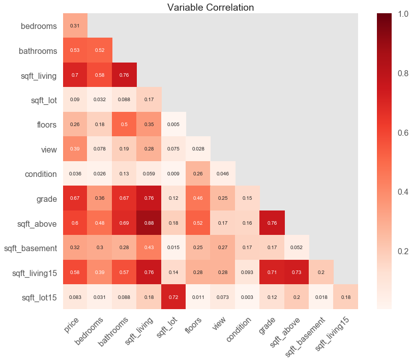
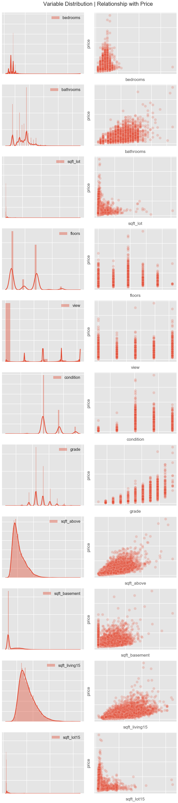
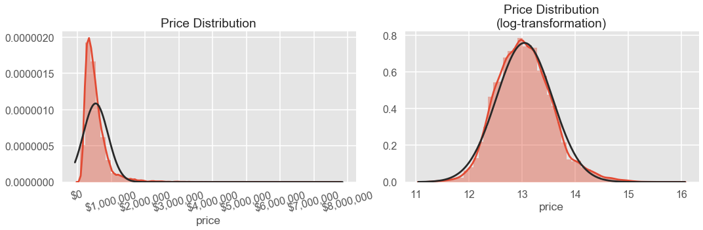
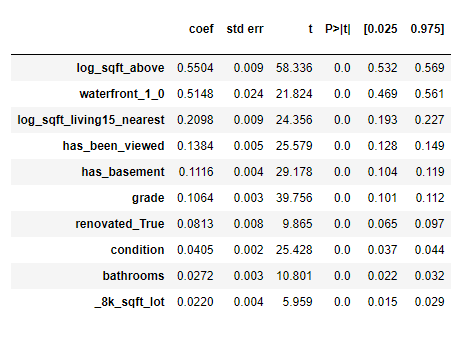
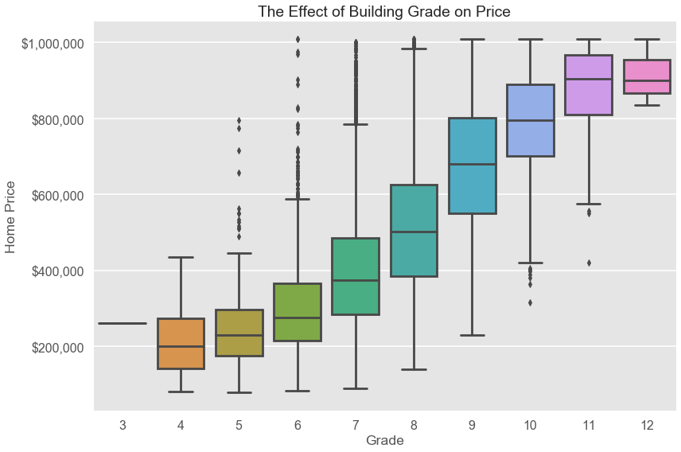
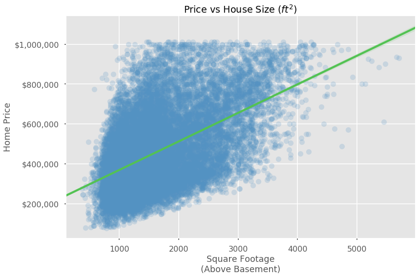

**Claude Fried**

**Aug 13, 2020**

# Introduction:

When it comes to selling a house, people always have a different perception of what the experience should be like. Sometimes a seller has sentimental attachment to the house they grew up in (or raised their children in). Other times, they feel that investments and improvements they've made to the house and/or property are worth more than they actually are.

Regardless of a seller's feelings, there are concrete ways to look at a house and determine an appropriate value.

In this project, we look at a dataset from *King County House Sales* and try to create some insight into the housing market in that area. The goal is to create a linear regression model which is highly interpretable and helps determine the relative value of different aspects of the house.

***

In order to make insights, we will use the *OSEMN* process.
> * **O**btain **S**crub **E**xplore **M**odel i**N**terpret - **OSEMN**

*Looking in detail:*
> **Obtain**: In this project, this is as easy as loading in the given dataset.
>
> **Scrub**: We will do general cleaning of the data. This includes:
>> - Casting columns to the correct data types.
>> - Filling in missing values.
>> - Normalizing the data (in this case, we'll be making one model with normalized / transformed data and another model without).
>> - Checking for multicollinearity between variables.
> 
>  **Explore**: We will look at the data and see its relationship to itself and the target variable (in this case, the price of a home).
> 
> **Model**: We will create Linear Regression models in order to have an interpretable result and concrete deliverables to sellers on the factors which produce the biggest change to home price.
> 
> **Interpret**: Finally, we can use our results and draw conclusions.

# Outline

The notebook follows an elaborated ***OSMEN*** process.

## Obtain

We were given data to work with for this project, so this step is simply reading in the data. 


```python
import pandas as pd

df_raw = pd.read_csv('kc_house_data.csv')
df_raw.head()
```


<div>
<style scoped>
    .dataframe tbody tr th:only-of-type {
        vertical-align: middle;
    }

    .dataframe tbody tr th {
        vertical-align: top;
    }

    .dataframe thead th {
        text-align: right;
    }
</style>
<table border="1" class="dataframe">
  <thead>
    <tr style="text-align: right;">
      <th></th>
      <th>id</th>
      <th>date</th>
      <th>price</th>
      <th>bedrooms</th>
      <th>bathrooms</th>
      <th>sqft_living</th>
      <th>sqft_lot</th>
      <th>floors</th>
      <th>waterfront</th>
      <th>view</th>
      <th>...</th>
      <th>grade</th>
      <th>sqft_above</th>
      <th>sqft_basement</th>
      <th>yr_built</th>
      <th>yr_renovated</th>
      <th>zipcode</th>
      <th>lat</th>
      <th>long</th>
      <th>sqft_living15</th>
      <th>sqft_lot15</th>
    </tr>
  </thead>
  <tbody>
    <tr>
      <th>0</th>
      <td>7129300520</td>
      <td>10/13/2014</td>
      <td>221900.0</td>
      <td>3</td>
      <td>1.00</td>
      <td>1180</td>
      <td>5650</td>
      <td>1.0</td>
      <td>NaN</td>
      <td>0.0</td>
      <td>...</td>
      <td>7</td>
      <td>1180</td>
      <td>0.0</td>
      <td>1955</td>
      <td>0.0</td>
      <td>98178</td>
      <td>47.5112</td>
      <td>-122.257</td>
      <td>1340</td>
      <td>5650</td>
    </tr>
    <tr>
      <th>1</th>
      <td>6414100192</td>
      <td>12/9/2014</td>
      <td>538000.0</td>
      <td>3</td>
      <td>2.25</td>
      <td>2570</td>
      <td>7242</td>
      <td>2.0</td>
      <td>0.0</td>
      <td>0.0</td>
      <td>...</td>
      <td>7</td>
      <td>2170</td>
      <td>400.0</td>
      <td>1951</td>
      <td>1991.0</td>
      <td>98125</td>
      <td>47.7210</td>
      <td>-122.319</td>
      <td>1690</td>
      <td>7639</td>
    </tr>
    <tr>
      <th>2</th>
      <td>5631500400</td>
      <td>2/25/2015</td>
      <td>180000.0</td>
      <td>2</td>
      <td>1.00</td>
      <td>770</td>
      <td>10000</td>
      <td>1.0</td>
      <td>0.0</td>
      <td>0.0</td>
      <td>...</td>
      <td>6</td>
      <td>770</td>
      <td>0.0</td>
      <td>1933</td>
      <td>NaN</td>
      <td>98028</td>
      <td>47.7379</td>
      <td>-122.233</td>
      <td>2720</td>
      <td>8062</td>
    </tr>
    <tr>
      <th>3</th>
      <td>2487200875</td>
      <td>12/9/2014</td>
      <td>604000.0</td>
      <td>4</td>
      <td>3.00</td>
      <td>1960</td>
      <td>5000</td>
      <td>1.0</td>
      <td>0.0</td>
      <td>0.0</td>
      <td>...</td>
      <td>7</td>
      <td>1050</td>
      <td>910.0</td>
      <td>1965</td>
      <td>0.0</td>
      <td>98136</td>
      <td>47.5208</td>
      <td>-122.393</td>
      <td>1360</td>
      <td>5000</td>
    </tr>
    <tr>
      <th>4</th>
      <td>1954400510</td>
      <td>2/18/2015</td>
      <td>510000.0</td>
      <td>3</td>
      <td>2.00</td>
      <td>1680</td>
      <td>8080</td>
      <td>1.0</td>
      <td>0.0</td>
      <td>0.0</td>
      <td>...</td>
      <td>8</td>
      <td>1680</td>
      <td>0.0</td>
      <td>1987</td>
      <td>0.0</td>
      <td>98074</td>
      <td>47.6168</td>
      <td>-122.045</td>
      <td>1800</td>
      <td>7503</td>
    </tr>
  </tbody>
</table>
<p>5 rows × 21 columns</p>
</div>


```python
df_raw.info()
```

    <class 'pandas.core.frame.DataFrame'>
    RangeIndex: 21597 entries, 0 to 21596
    Data columns (total 21 columns):
     #   Column         Non-Null Count  Dtype  
    ---  ------         --------------  -----  
     0   id             21597 non-null  int64  
     1   date           21597 non-null  object 
     2   price          21597 non-null  float64
     3   bedrooms       21597 non-null  int64  
     4   bathrooms      21597 non-null  float64
     5   sqft_living    21597 non-null  int64  
     6   sqft_lot       21597 non-null  int64  
     7   floors         21597 non-null  float64
     8   waterfront     19221 non-null  float64
     9   view           21534 non-null  float64
     10  condition      21597 non-null  int64  
     11  grade          21597 non-null  int64  
     12  sqft_above     21597 non-null  int64  
     13  sqft_basement  21597 non-null  object 
     14  yr_built       21597 non-null  int64  
     15  yr_renovated   17755 non-null  float64
     16  zipcode        21597 non-null  int64  
     17  lat            21597 non-null  float64
     18  long           21597 non-null  float64
     19  sqft_living15  21597 non-null  int64  
     20  sqft_lot15     21597 non-null  int64  
    dtypes: float64(8), int64(11), object(2)
    memory usage: 3.5+ MB
    

## Scrub

- Preliminary investigation.
- Cast columns to the appropriate data types.
- Identify and dealing with `NaN` values.
 - Re-casting datatypes.
- Remove columns which won't be used for modeling.
- Deal with multicollinearity.

***

*It is at this point that the notebook branches. First, we continue to engineer data for use in the predictive model. We return to this point in order to get non-transformed data for interpretability.*

***



***



### Predictive model.

- Normalizing the data (z-score).
- One-hot encoding categorical columns.

## Explore

Since interpretability isn't the goal for the first model, I use a healthy amount of log-transformations as a part of the exploration portion.

- Log-transform appropriate columns.

- Remove outliers from target variable.
- Remove egregious outliers from predictive columns.

### Feature Engineering
# Explain this
- Create boolean categorical columns: 
 - `8k_sqft_lot`, 
 - `has_been_viewed`, 
 - `has_basement`, 
 - `8k_sqft_lot15_nearest`

## Model 1


```python
Train r_squared:
0.8635496506832979

Test r_squared:
0.8578350358782842
```

Model 1 performs well and shows the most important features.

*Sorted by importance:*


Of course, this is not , as everything has been altered so heavily in transforming and normalizing.

## Model 2

At this point we return to the data before it has been normalized and transformed in order to have a more interpretable model.

What are the **dollar-amount effects** of each variable?

### Data Processing (pt 2)

- Remove outliers (based on **IQR**)


## Interpret

```
Training R^2:	0.8199609367320893
Test Data R^2:	0.8244254571987037

Training MSE:	6953650580.208784
Test Data MSE:	7032223515.148423
Percent Difference:	1.12%
```

`zipcode` by far was the most important feature, followed by the following features:


# Conclusion

We can say without question that the top two most important features of a home are its **location**. Apparently the old adage about *location, location, location* in real estate exists fro a reason.


Having a home in certain **neighborhoods** increases (or decreases) the value of your home considerably. This makes sense, as you can imagine a home in the middle of the desert will be worth much less than the same home on Laguna Beach.


The next most important factors are the building itself - both the **building grade** and whether or not it has been **renovated** have large impacts to the price of the home.



Additionally, every **square foot** counts a great deal. Adding additional square feet will increase the value of the home by $100 per square foot.



***

For sellers, it is important to take note that the *quality* and *location* of the building is more important than the number of bathrooms or the size of the yard.

# Future Work

Additional data could be used for this type of model.

1. **Days on Market**
 - Does the number of days on the market impact the sale price?
 - Are there certain attributes that will make a home sell faster?
 
 
2. **Competing Homes**
 - Based on the attributes of all homes on the market at a given time, can we predict where their prices will end up ?

3. **School Districts**
 - Is attraction to a certain school district a motivating factor for buyers?
 - Could this increase the home's value?
